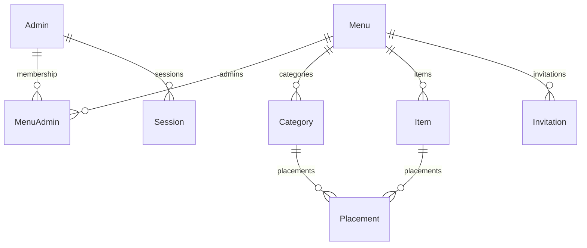

# Generated relationships

Do not edit. Source: schema.json.

```mermaid
erDiagram
  Admin ||--o{ MenuAdmin : "membership"
  Menu ||--o{ MenuAdmin : "admins"
  Menu ||--o{ Category : "categories"
  Menu ||--o{ Item : "items"
  Item ||--o{ Placement : "placements"
  Category ||--o{ Placement : "placements"
  Menu ||--o{ Invitation : "invitations"
  Admin ||--o{ Session : "sessions"
```
